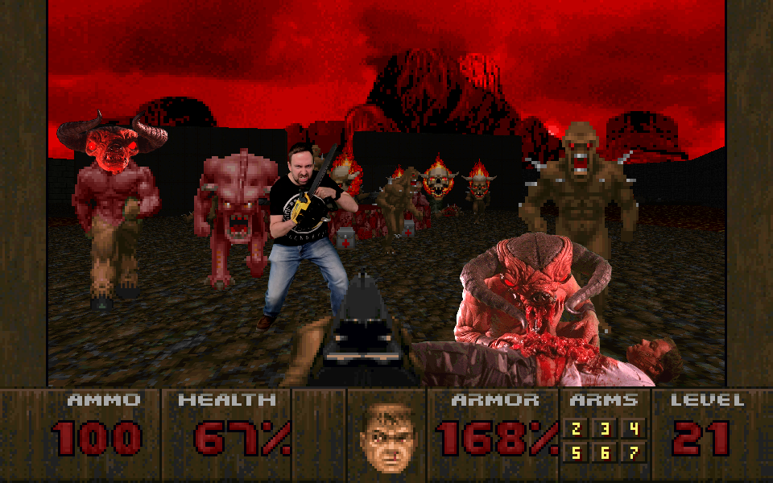

# Phoenix DOOM

A backport & remaster of 3DO DOOM for Windows, MacOS and Linux.

## About This Project

Phoenix DOOM is a project derived from the [3DO DOOM source code release by Rebecca Ann Heineman](https://github.com/Olde-Skuul/doom3do). The aim of this project is to allow the original 3DO version of DOOM to be played on modern operating systems with enhancements, bug fixes and other quality of life improvements. The idea is to improve upon and remaster the original while still preserving its primary essence.

See the following documents for more info on the project:

- [How To Play & Configuring](docs/How%20To%20Play.md)
- [Differences To 3DO DOOM](docs/Differences%20To%203DO%20DOOM.md)
- [Q&A / About The Project](docs/Q%26A.md)
- [Known Issues](docs/Known%20Issues.md)
- [Credits](docs/Credits.md)
- [License / Copyright](docs/License%20%26%20Copyright.md)
